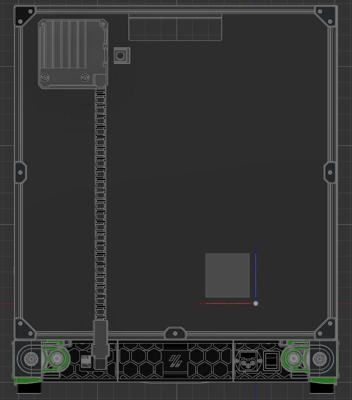
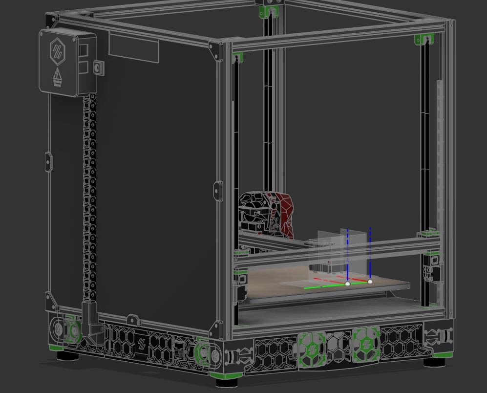

# Electronics-Pack

A simple electrical distribution box made for Voron 2.4 with the purpose of making rear connections neater especially when using tool changers. 

## Introduction

On my 2.4 I have/will have running to the rear top of the printer:
  1. Rear exhaust fan
  2. LED Lights
  3. CANBUS + Power cable
  4. VOC Scrubber

I thought it would be a good opportunity to reuse the XY cable chains that came with my 2.4 kit which was made redundent when I moved to CANBUS. 
Currently this is designed for a Voron 2.4 350mm in mind and is not tested for say the Trident. 
Depending on your use case, the idea is to purpose design and print the appropriate 'Outlet Cover' with the right thread size you will need. It is able to accommodate up to 18mm holes but to be safe it should be kept up to 16mm max diameters. Optionally just run without the cover; it still covers a significant amount of wires and just use sleeves. 

## BOM

- 2x M3x8mm SHCB
- 2x M3x6mm Counter sunk screw
- 4x M3x5x4mm “standard” Voron heatsets"
- 4x 6mm(D)x3mm(H) Neodymium magnets
- 2x M3x15mm SHCB
- 22 segments cable chain (E2i.10 series)

Optional

- PCB (for CANBUS distribution) 75x25mm
- 2x M2x10 self tapping screw
